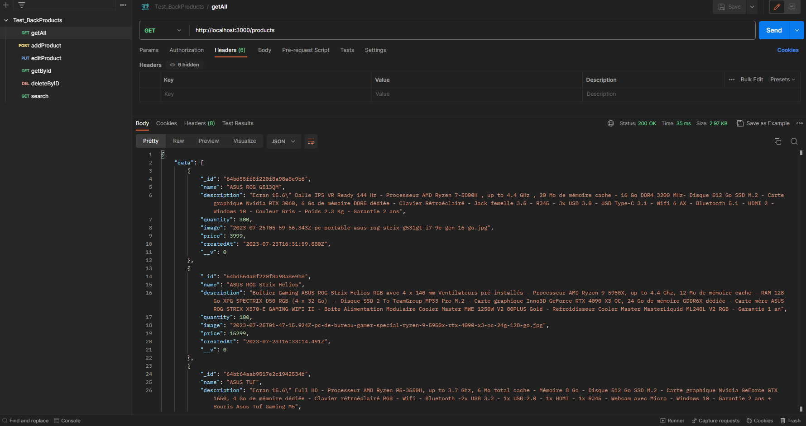
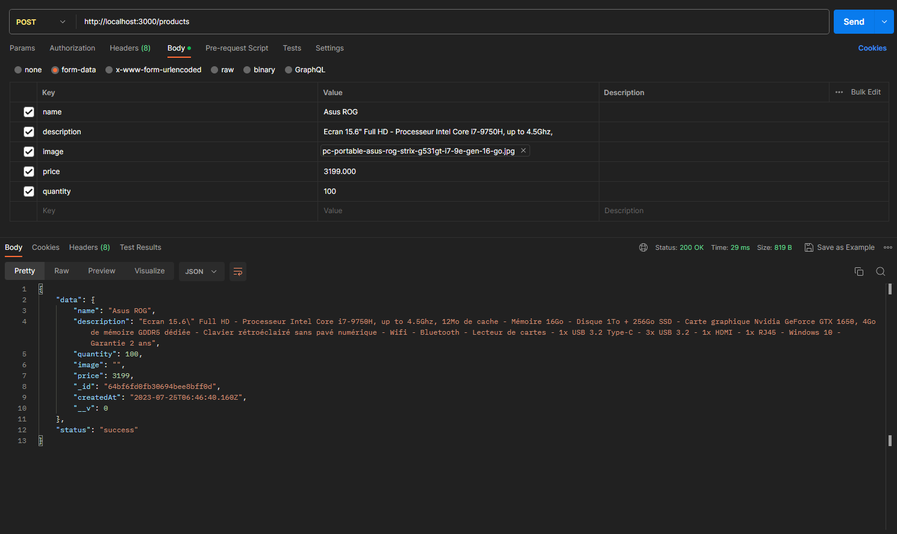
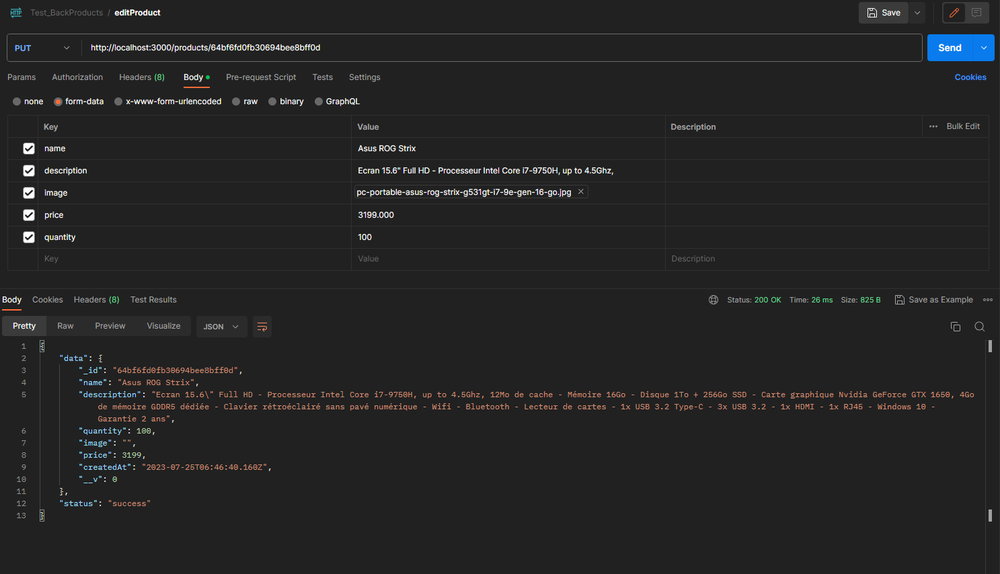
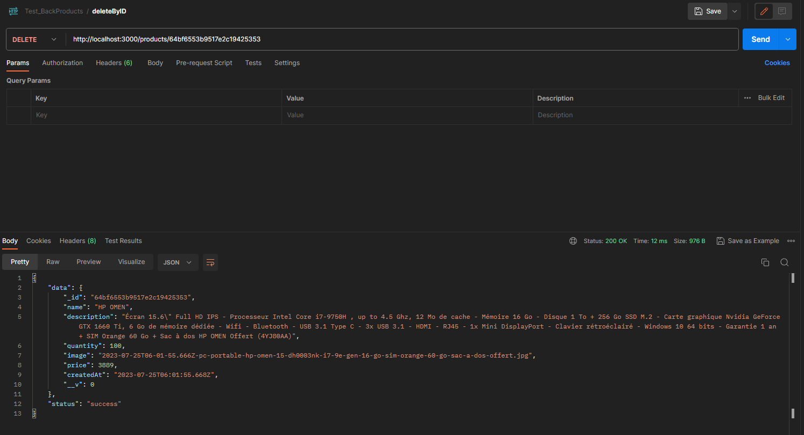
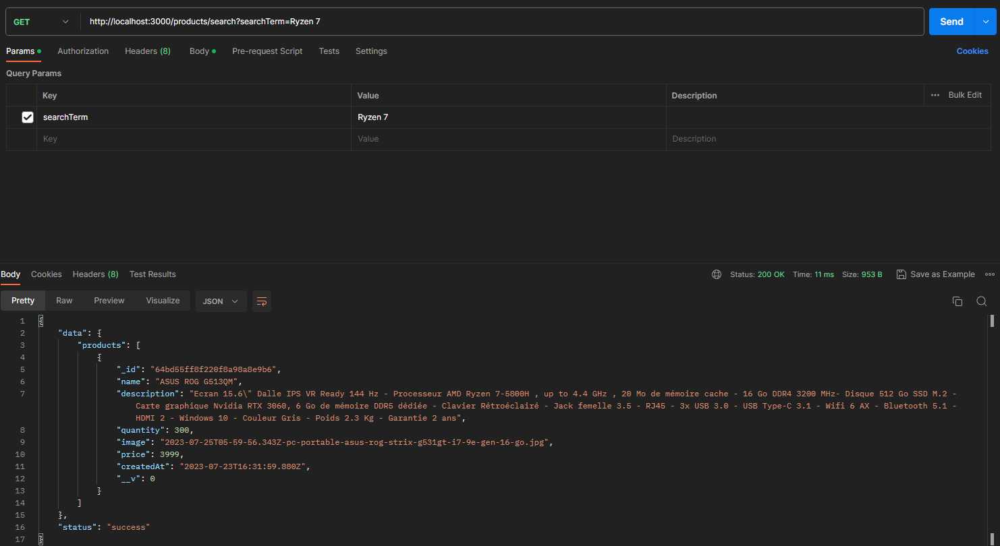

  <h1>CRUD Mini Project with React.js and Node.js</h1>
  
The CRUD Mini Project is a web application built using Node.js and React.js, designed to showcase the fundamental CRUD operations (Create, Read, Update, Delete and Search). The project aims to demonstrate how to interact with a backend server using Node.js while building a interactive frontend data table with React.js.

## Table of Contents

- [Features](#features)
- [Screenshots](#screenshots)
- [Technologies Used](#technologies-used)
- [Frontend Repo](#frontend-repository)
- [Installation](#installation)
- [Contributing](#contributing)

## Features

- **Create:** Users can add new product records to the data table, including images.
- **Read:** The application fetches and displays existing product data in a clean and organized data table.
- **Update:** Users can edit and update product details, including product images.
- **Delete:** The application allows users to delete unwanted product records from the data table.
- **Search:** Users can search and filter products based on specific criteria.

## Frontend Screenshots

  
  
Get All API

  
  
Create Product API

  
  
Edit Product API

  
  
Delete Product API

  
  
Search For Product API

## Technologies Used

- **React.js:** A powerful JavaScript library for building interactive user interfaces.
- **Node.js:** A versatile JavaScript runtime for server-side development.
- **Express.js:** A fast and minimalist web application framework for Node.js.
- **MongoDB:** A NoSQL database for storing product data and images.
- **Multer:** A middleware for handling multipart/form-data, allowing image uploads.
- **Axios:** A promise-based HTTP client for making API requests from the frontend to the backend.
- **Bootstrap:** A popular CSS framework for creating responsive and visually appealing web applications.

## Frontend Repository

For the frontend code of this project, visit the [Frontend Repository](https://github.com/chiheb7898/CRUD-ReactJS).

## Installation

1. Install MongoDB on your localhost. You can download it from the official MongoDB website: https://www.mongodb.com/try/download/community
2. Clone the repository: `git clone https://github.com/chiheb7898/CRUD-NodeJS.git`
3. Navigate to the project directory
4. Install backend dependencies: `npm install`
5. Start the React backend: `npm start`

## Contributing

Contributions to this project are welcome! If you have any ideas, bug fixes, or feature improvements, feel free to submit pull requests.

